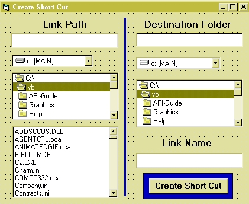



## Create Short Cut

### Description

this is to Create a shortCut for anyFile in any Directory, the API code just create shortCut in Desktop or startMenu Only, but this Code Goes around this
 
### More Info
 

             |
---                |---
**Submitted On**   |2008-04-15 16:00:02
**By**             |[Waguih Youssef Sami](https://github.com/Planet-Source-Code/PSCIndex/blob/master/ByAuthor/waguih-youssef-sami.md)
**Level**          |Intermediate
**User Rating**    |4.7 (14 globes from 3 users)
**Compatibility**  |VB 5\.0, VB 6\.0
**Category**       |[Files/ File Controls/ Input/ Output](https://github.com/Planet-Source-Code/PSCIndex/blob/master/ByCategory/files-file-controls-input-output__1-3.md)
**World**          |[Visual Basic](https://github.com/Planet-Source-Code/PSCIndex/blob/master/ByWorld/visual-basic.md)
**Archive File**   |[Create\_Sho2109694152008\.zip](https://github.com/Planet-Source-Code/waguih-youssef-sami-create-short-cut__1-70421/archive/master.zip)

